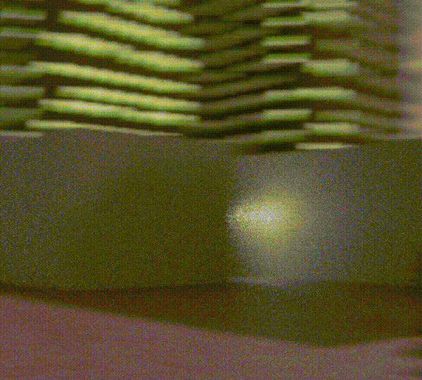
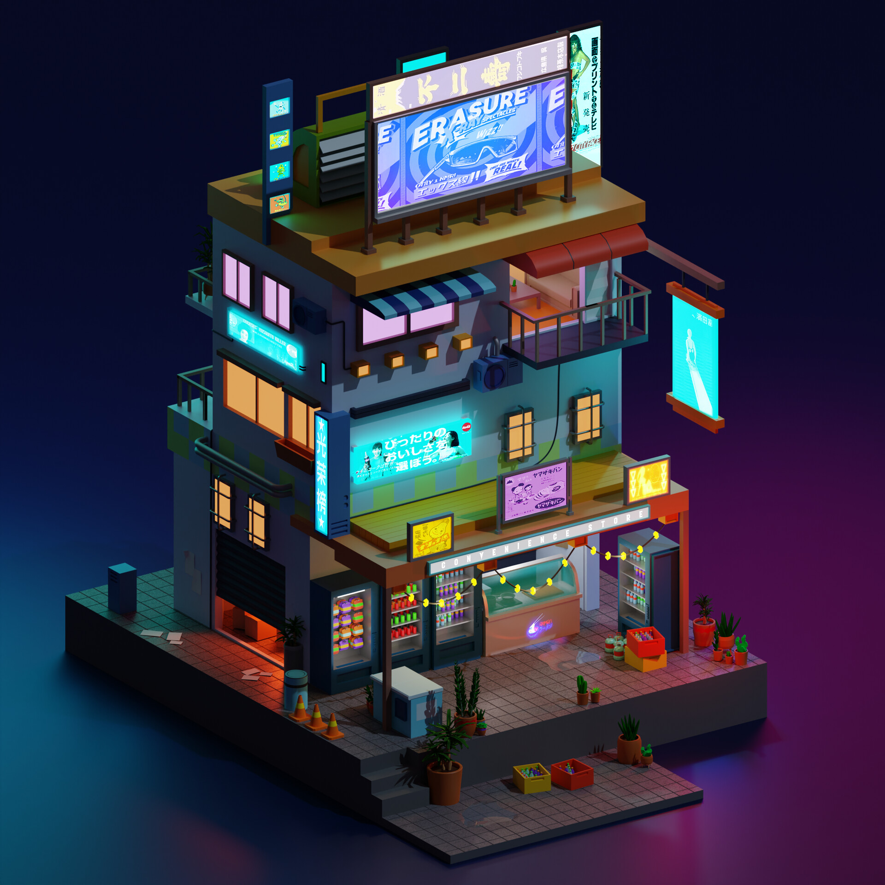
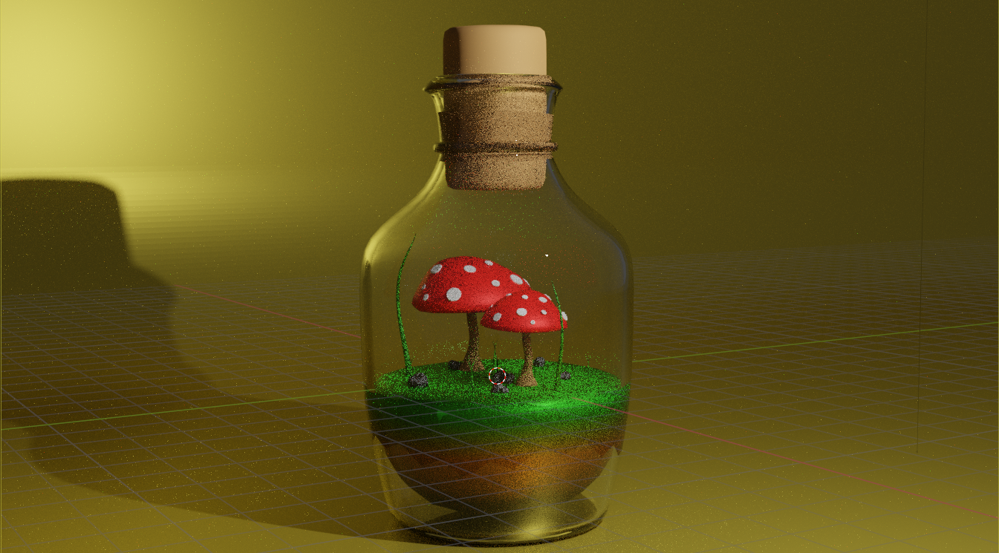

# 3D Portfolio

Welcome to my 3D portfolio! This project showcases my skills in creating and displaying 3D models and scenes using Blender.

## Preview

Below is a preview of some of the 3D projects featured in the portfolio:

<div align="center">
  
  <hr>
   
  <hr>
  
  <hr>
  
</div>

## Features

- Interactive and low-poly 3D models
- Realistic textures and lighting

## Installation

1. Clone this repository:

   ```bash
   git clone https://github.com/t8ne/3d-portfolio.git
